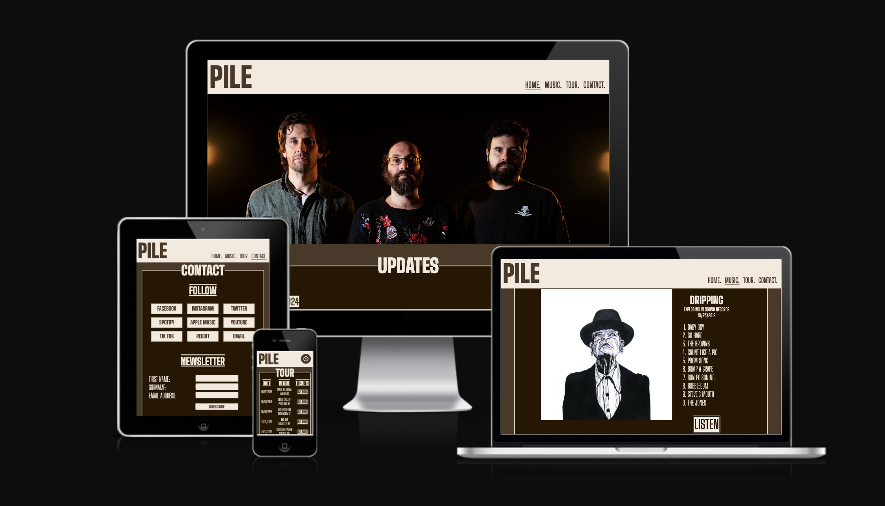

# PILE FANSITE
This website has been designed to create band awareness for PILE and give fans a place to come and easily find out if there are any news updates, new material or opportunities to watch them perform. As well as links to their other social and audio platforms to listen to their music, watch their music videos or follow them directly, with means to contact them in a variety of ways if they wish.  

## Features
Screenshots and explainations of each of the main features and sections of the page. What it does. Why its their.
## Testing
How did I test the sites functionality. Different browsers. responsive on all screen sizes. each section is readable and easy to use. All functions work.
## Bugs
What bugs I found and how i fixed them. Are any bugs still there?
## Validation
HTML/CSS validators used. Lighthouse screenshot.
## Deployment
How did I deploy the site using GitHub. 

Visit my website [here.](https://bekmart.github.io/pile_fansite/)
## Credits
CONTENT - code that Ive used form other sources. CI love running project influence. 
MEDIA - Links, images, videos, content used. 

[def]: https://assets/images/am-i-responsive.png