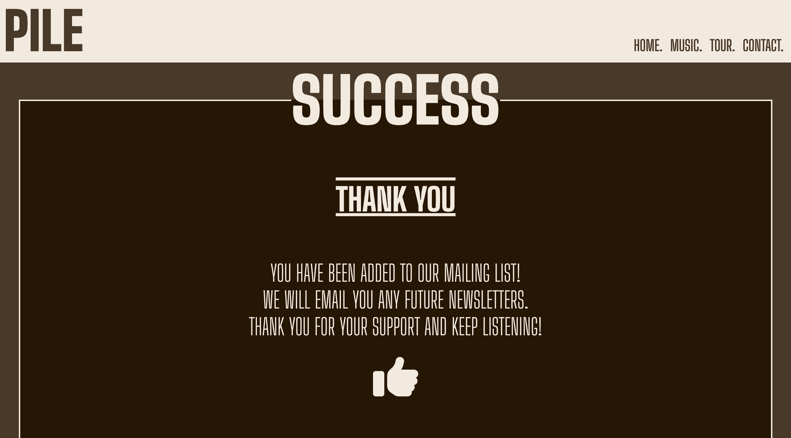

# PILE FANSITE

This website has been designed to create band awareness for PILE and give their fans a place to come and easily find out if there are any news updates, new material, upcoming events to watch them perform and an opportunity to sign up and recieve their newsletters. There are links to audio platforms to enable users to listen to PILE's music and watch their music videos. It also features links to their social media sites so users can follow and contact the band via their preffered channels.

![Screenshot of my website displayed on several different sized device screens, using a web app called 'Am I Responsive', showing that my website has been adapted to look good on all devices.][responsive]

## Features

### Existing Features

### - Navigation Bar

- The navigation bar is featured at the top, in the header of all associated pages within the site. It is fixed to enable users to easily navigate through the website at all times and creates continuity, without having to rely upon the 'back' button to navigate at any point. 
- On the left of the header is the name of the band in big bold font, this is always visible and when clicked will return the user back to the home page. On the right, are the headings and links to the other pages within the website. The page that the user is currently on is highlighted with an underline, so the user knows where they are within the website and can easily find their way to whatever section they want, which is clearly and intuitively labelled. 
- On mobile and smaller devices, the navigation section is within a drop down toggle, to utilise space effectively, the user will need to click on the icon of a record, which is the same as the favicon in the tab, to enable it to drop down and select which page they wish to view.

![Screenshot of the navigation bar, sitiuated in the header of the webpage. On the left is the bands name written in large. On the right is a list of the other page headings, (home, music, tour, contact) which represent the links ot their respective pages. Home is underlined as it is the page which is currently being viewed.][navbar]
 
### - The Landing Image

- There is a large, striking image of the three members of PILE visible at the top of the landing page, which introduces the user to the band and grabs their attention before viewing the rest of the content available. 

![Image of the band which is at the top of the landing page. It is a dark image of the three band members standing side by side which spans the width of the page.][hero-image]

### - Updates Section

- This section is a space to display any messages or news about the band. Each update has the date, some text and often an image or video file, advertising new released content. This section will enable the user to feel up to date with any current affairs relating to the band, compelling them to return regularly to check for updates. 
- There are iframe videos of music videos that have been released. The user can click to view the video in the page, they can control the play and volume settings, enlarge it to watch in full screen or watch it via YouTube where it has been sourced from. PILE produce very abstract music videos which are aesthetically appealing, adding an attractive element to the page and drawing in the user, who will want to see their newest releases. 
- There are links between the updates on the home page to other pages where relevent, which further assists the user in navigating fluently through the pages. 
    - There is a poster of the upcoming tour dates and a link to the tour page, where people can see the dates more clearly and click a link to purchase a ticket.
    - On the post about a new release, there is a hyperlink to the album for users to check out on the music page. They can view the album cover, track list and visit a link to the bands spotify to hear that specific album. 
- Responsive design has been used for different devices to organise the content so that it flows better, making it more visually pleasing to the user. 
    - On mobile and smaller screens the posts are one on top of each other. 
    - On tablets, the updates are larger and staggered with more padding around them. 
    - On larger screens, the updates are staggered and in two columns to reduce the amount of negative space present on the page.  

![Image of the updates section, showing a heading, placed inside a fieldset. The latest update is at the top, showing the date posted, a small amount of text stating that the band are doing a US tour, with a link to the tour page and an image of a tour poster. Staggered a little further down on the right hand side is another post of an album cover which has just been released, with a link to the album in the music page. This is also dated with a short explaination of what the post is showing.][update-screen]

### - Band Member Images

- A section showing images of each of the band members, playing on stage with their names over their picture. This tells the user instantly who is who in the band, enabling them to put a face to a name and an instrument, just by viewing some eye catching images of the band in action. 
- The layout of these images changes throughout different screen sizes, to make most effective use of the space available while ensuring that ther images are clearly visible to the user. 
    - On mobile and smaller devices, they are stacked in a column, using flex and relative and absolute positioning for the name text.
    - In tablet sized devices they are staggered, from left to right, using relative and absolute positioning and z-index, where the images overlap. 
    - On larger devices like desktops, they are lined up horizontally, using flex.

![Screenshot of the band member pics horizontally in the desktop format. The first image is of Rick on stage, shouting into a microphone, holding a guitar with a keyboard in front of him. In the middle is a picture of Alex playing a yellow base guitar and a keyboard. The last of the three images is of Kris playing the drums. In the top left corner of each of the images is their names in large white font on dark backgrounds.][band-member-screen]

### - The Footer

- The footer is featured at the bottom of each page and has the same layout on all devices, just with different sized spacing between the different elements, depending on the width of the screen, using flex. This creates continuity and is easy for the user to use intuitively. 
- In the centre at the top is a copyright message, followed by the name of the author of the website; BekMart. 
- Underneath are links to PILE's five main social media or audio platforms which are all represented by their well-known logos; a much more attractive way of presenting the pages. When clicked, a new browser will open and take the user to the intended website, leaving a tab open on this website so that the user can return easily. 

![Screenshot of the footer. At the top in the centre it says Copyright 2024. Directly underneath it says the authors name; BekMart. Spread out evenly underneath this are the bands main social media links, which are represented by their well-known logos. (Facebook, Instagram, Twitter, Spotify, Apple Music)][footer-screen]

### - The Music Page

- The Music page lists PILE's complete music catalogue. It is split into two sections; 'Albums' and 'Other Releases' and the contents is in order of their release date, with the most recent at the top. 
- Each item in the section has the cover artwork displayed, with the title in bold, the details of the record label who produced the audio, the release date and the tracklist. The artwork is displayed big and bold as the images are abstract and alluring, giving the page a pleasent feel, encouraging the user to continue browisng the website. 
- A bold button labelled 'listen' is clearly situated underneath each of the records, linking the user to the band's Spotify page, to the specific album they have chosen to listen to.
- After viewing this page, the user will know all of PILE's audio collection, and have access to their tracks directly via this page. 
- This page is responsive on all sized devices. 
    - On smaller screens, the details, track list and the Spotify link are underneath the record cover.
    - On larger screens the album information is adjascent to the cover, on the right hand side, using float.

![Screenshot of the music page. There is a heading at the top; 'Albums' which is decorated with lines above and underneath. The album cover is on the left hand side of the screen, taking up half of the page. The name of the album, the record label and date of release are detailed to the right hand side of the image in the center of the negative space. To the right of this space is the track list and underneath that is a large button to click which will take the user to a new screen to listen to the album on spotify][music-screen]

### - The Tour Page

- The Tour page details any upcoming events that the band are performing. It clearly states in a table format the date, venue and a link to purchase tickets from another site, which will open in a seperate window, to enable the user to easily return to this website.
- Users will come to this page to see where and when the band are playing, they can choose the most suitable event for them and easily be led to a page to purchase a ticket. It takes any hassle away from searching through ticket vendor sites, as this is tailored towards PILE events.  
- As PILE do not currently have any upcoming events, I have just linked the tickets buttons to a ticket website, which usually sells their event tickets when they are available. 

![Screenshot of the top of the Tour Page. The page title is in the centre of the fieldset box. Inside this there are three headings at the top of the page which are defined by being in bold and decorated with lines over and underneath (date, venue, tickets). Listed underneath these headings are the relevant details. Underneath the tickets heading are large, bold, identical buttons, which when clicked take you to a website to purchase a ticket to that particular event][tour-screen]

### - The Contact Page

- The contact page is formed of two sections; the follow section and the newsletter section, the headings are displayed in bold with lines over and underneath, in unison with the previous pages. 

    - The follow section is a list of nine links to the bands social media and audio platforms. The links are all set out in boxes, with the name of the website the user will be directed to clearly labelled in it. Once clicked the targetted website will open in a new window for the user to browse, whilst leaving the current tab open with this website still displayed. Enabling the user to visit other sites related to the band but also still have access to this page. 
    - The boxes are all arranged on the page through responsive design using flex. 
        - On smaller devices they are in one single column.
        - On larger devices, they appear in a grid with 3 rows and columns.

![Screenshot of the follow section within the contacts page. A heading of Contact is in the top, centre of the fieldset box. Underneath this is a heading of follow which is bold and decorated with lines over and underneath. There is a grid effect of nine boxes with the name of social media and audio platforms in them in rows and columns of 3 in the centre of the section][contact-screen]

- The newsletter section is located underneath the follow section. 
    - There is a form for the user to complete to subscribe to a newsletter, with three entry points which are clearly labelled and easy to use (First name, Last name, Email address). The subscribe button is clearly underneath the data entry points. This form is easily visible and intuitive so the user won't have any trouble in finding and completing it. 
    - If any information is not completed in the correct format then there will be some feedback to tell the user that this hasn't worked and indicate why to encourage them to complete the form correctly. This will happen if:
        - Any fields are empty.
        - The email address doesn't contain an @ or . in the correct places. 
    - This section is responsive on all devices, so that it fits and flows well.  

![Screenshot of newsletter section on contacts page. The newsletter heading is bold and decorated with lines above and underneath, consistent with other headings. There is a simple form to complete by filling in first name, surname and email address. A subscribe button is located underneath to submit the request. This is all in the centre of the section at the bottom of the contacts page][subscribe-screen]

### - Success page

- Once the subscription form has been completed correctly, the success page will appear, with a message thanking them for supporting the band and ensuring them that they will recieve future newsletters. 
- This gives the user piece of mind that their details have been acknowledged and logged correctly. 
- The page layout is consistent with the rest of the website and the navigation bar is displayed so they can return and continue to browse the rest of the website easily. 

### - 404 error page

- If the url is entered incorrectly then a 404 error page will appear. 
- This tells the user that the page they have entered is incorrect but offered them a link to the home page and includes the navigation bar to get to whichever part of the website they are specifically looking for. 

### Features Left To Implement

### - Merchandise Page

- If I had more time, knowledge and a higher skill-sets then I would like to have added a merchandise page to this website. 
- This would have involved going through payment authentication which is out of my current remit. 
- This would add value to the page, as the user would be able to browse and purchase audio products or apparel from one place.

## Testing
<!--How did I test the sites functionality. Different browsers. responsive on all screen sizes. each section is readable and easy to use. All functions work.
In this section, you need to convince the assessor that you have conducted enough testing to legitimately believe that the site works well. Essentially, in this part you will want to go over all of your project’s features and ensure that they all work as intended, with the project providing an easy and straightforward way for the users to achieve their goals.

In addition, you should mention in this section how your project looks and works on different browsers and screen sizes.

You should also mention in this section any interesting bugs or problems you discovered during your testing, even if you haven't addressed them yet.

If this section grows too long, you may want to split it off into a separate file and link to it from here.-->
- I tested that this webpage works in both Chrome and Safari. Everything worked perfectly fine on Chrome, however the Apple music links wont work in Safari.
- I confirm that all pages on this website are responsive and look good on all standard sized screens, using the devtools device toolbar. 
- The content of all the pages is readable, consistent in layout and easy to use intuitivaly. I have used consistent and contrasting colours throughout the website. Each page has a similar layout with the page title in the top centre of the fieldset box and any further headings in the same style. All links are clearly labelled and visible. 
- All of the functions work as expected. All links go to the correct place and open in seperate windows if the destination is a different website. The music videos play when the user clicks on them and they are able to control the volume, mute, pause or view on full screen. The form in the contact section works as intended, the user must complete each field correctly, otherwise an indicator will show what they have missed/completed incorrectly. Once submitted a webpage is shown with a table containing the information that has been recorded via a CI website.  

### Validation
### - HTML
- No errors were returned when passing through the official [W3C validator](https://validator.w3.org/#validate_by_input).
### - CSS
- No errors were returned when passing through the official [Jigsaw validator](https://jigsaw.w3.org/css-validator/#validate_by_input)
### - Lighthouse
- I completed an audit through Chrome Devtools using the Lighthouse program. The results were as follows-

![Screenshot of Lighthouse results. Performance is amber with result of 81. Accessability is green 100. Best Practices is green 95. SEO is green 100.][lighthouse]

### Bugs
### - Solved Bugs
<!--What bugs I found and how i fixed them.-->
- On the music page, for the album 'In the Corners of a Sphere-Filled Room', there is no track list as it is just an experimental, instrumental piece. Therefore, there was no ordered list to target like the other albums on the page. 
    - Initially I just targetted the p element with the same instruction as the ol elements, which was padding-left:650px; , but this just shifted the text to the right, and not alongside the album cover, with the button remaining underneath.
    - I had to use the clear: right; command to get the text to float on the right hand side of the album which was floating on the left hand side of the page. Then the text was aligned with the rest of the page and the button sat where I would expect it to. 
### - Unfixed Bugs
<!--You will need to mention unfixed bugs and why they were not fixed. This section should include shortcomings of the frameworks or technologies used. Although time can be a big variable to consider, paucity of time and difficulty understanding implementation is not a valid reason to leave bugs unfixed.-->
- On the music page, for the album 'Songs Known Together, Alone' the 'listen' button is not in the same position as the others. It sits in the middle of the page rather than in the middle of the empty space which sits on the right hand side. 
    - In order to rectify this, I tried to give the specific button an id and move it across to the right but that didn't work. 
    - A clear value was added to a float attribute to try to resolve this but that also didn't respond. 
    - If the margin-bottom was increased further between each of the div elements which contained the album covers, then this would work but it doesn't look great with the rest of the page as it is too spaced out. 

## Deployment
- The website was created in Gitpod and deployed to GitHub pages via the terminal. Once in GitHub, the steps to deploy were as follows:
    - In the GitHub repository pile_fansite, navigate to the Settings tab
    - On the left hand side, click on 'Pages' in the 'Code and automation' section
    - Ensure that 'Source' is set to 'Deploy from a branch'
    - Select 'main' in the branch section and '/(root)' in the folder section, using the drop-down menus
    - Click the save button
    - Return to the Code tab and wait for a few minutes for the build to finish before refreshing the repository page
    - Click the 'Deployments' button found on the right hand site of the page
    - At the top of this page will be a link to the deployed website

Visit the live website [here.](https://bekmart.github.io/pile_fansite/)

## Credits
### - Content
- I used some of the code from the CI [Love Running](https://bekmart.github.io/love_running/index.html) walkthrough project. 
    - The style and toggle in the header 
    - The social media links in the footer
### - Media 
- The favicon I used was sourced from https://gauger.io/fonticon/
- The icons that were used to represent the social media and audio platforms were from [Font Awesome](https://fontawesome.com/search)
- The font was from [Google Fonts](https://fonts.google.com/specimen/Big+Shoulders+Display?preview.text=PILE%20some%20general%20text&preview.size=47&query=big&stroke=Sans+Serif)
- The landing image of the band was found via Google on https://grandstandhq.com/wp2013/wp-content/uploads/2023/01/Pile-All-Fiction-_-Credit-to-Emme-Rovins-scaled.jpeg
- The image of the bands tour date poster was found on PILE's existing website https://pilemusic.com/
- The music videos on the updates page were sourced from YouTube https://www.youtube.com/watch?v=81pRkyNROio and https://www.youtube.com/watch?v=LDTkn22m4EE
- The images of the individual band members was found via Google and sourced from https://digboston.com/fotobom-pile-mal-devisa-arts-at-the-armory/
- The images of the album covers were taken from https://pile.bandcamp.com/music and https://post-trash.com/news/2020/8/24/pile-demonstration-reissue-album-review and https://thirdmanrecords.com/products/pile-live-at-third-man-records 

[responsive]: assets/images/am-i-responsive.png
[navbar]: assets/images/navigation-bar.png
[hero-image]: assets/images/hero-image.jpeg
[update-screen]: assets/images/update-screen.png
[band-member-screen]: assets/images/band-member-screen.png
[footer-screen]: assets/images/footer-screen.png
[music-screen]: assets/images/music-screen.png
[tour-screen]: assets/images/tour-screen.png
[contact-screen]: assets/images/contact-screen.png
[subscribe-screen]: assets/images/subscribe-screen.png
[lighthouse]: assets/images/lighthouse.png

